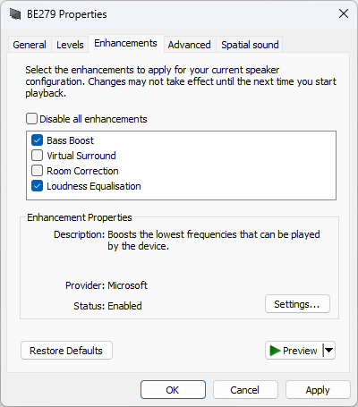

# Enable Bass Boost
Automatically adds and enables Bass Boost to any playback device.

| before execution | after execution |
| --------------- | -------------- |
|   |   |

Bass Boost works by reducing the gain of higher frequencies to avoid clipping, which means you have to increase volume. If you don't have enough amplification to spare to handle low volume audio sources, you could use `-enableLoudness` to increase source audio gain.

# How to Download and Run
run in powershell
```
Invoke-WebRequest https://raw.githubusercontent.com/Falcosc/enable-bass-boost/main/EnableBassBoost.ps1 -OutFile $env:HOMEPATH\EnableBassBoost.ps1
Set-ExecutionPolicy -ExecutionPolicy RemoteSigned -Scope CurrentUser
Get-Help $env:HOMEPATH\EnableBassBoost.ps1 -ShowWindow
Show-Command $env:HOMEPATH\EnableBassBoost.ps1
```
# When is it needed?
- HDMI, Display Port, Digital Optical Output playback devices usually doesn't have it
- if you can not find an audio driver version which adds loudness equalisation to any of your playback devices
- you can't enable it globally in your driver

# Why does it need to be scripted?
- if you want to toggle it via hotkey
- updates are messing with your audio drivers
- some use cases lead into re-registration of HDMI or DisplayPort playback devices, which will purge your settings every time

# What does it do?
1. search for all active playback devices by name in registry
1. registry import sets form factor and speaker properties to be same like full range speakers and defines bass boost settings
    
    Only 6 registry properties are needed to enable bass boost. The script is applying them only if they are needed
    ```
    "{d04e05a6-594b-4fb6-a80d-01af5eed7d1d},1"="{62dc1a93-ae24-464c-a43e-452f824c4250}" ;PreMixEffectClsid activates effects
    "{d04e05a6-594b-4fb6-a80d-01af5eed7d1d},2"="{637c490d-eee3-4c0a-973f-371958802da2}" ;PostMixEffectClsid activates effects
    "{d04e05a6-594b-4fb6-a80d-01af5eed7d1d},3"="{5860E1C5-F95C-4a7a-8EC8-8AEF24F379A1}" ;UserInterfaceClsid shows it in ui
    "{1864a4e0-efc1-45e6-a675-5786cbf3b9f0},4"=hex:03,00,00,00,01,00,00,00,02,00,00,00 ;enable bass boost
    "{1da5d803-d492-4edd-8c23-e0c0ffee7f0e},0"=dword:00000001 ;FORM_FACTOR is needed if you form factor does not support bass boost
    "{1da5d803-d492-4edd-8c23-e0c0ffee7f0e},6"=dword:00000000 ;FULL_RANGE_SPEAKERS is needed if the option was set to 3
    ```
1. restarts audio service to apply changed registry values

# Known Issues
- all bass boost settings get overwritten, instead of just enabling bass boost
- flag keys are different across Windows versions, it works for Windows 11, maybe 10 as well.
- If the playback device gets re-detected the audio service reboot maybe sets volume to default 100%
- Sound Settings UI shows 0% volume if it was open during restart (reopening fixes it)
- Restarting audio service after sleep does break the taskbar tray icon volume slider in some situations
    - mediakeys and sound settings UI volume controll still works fine
    - tray icon slider gets fixed with full reboot
- device is shown as full spectrum speaker in sound settings UI device properties
- if your driver removes your registry folder because of the fake speaker type,
    - avoid this known issue by using `-noFakeProperties` combined with regular script execution on each device reconnection
    - or handle the consequences by overwriting the 100% default volume with `-defaultStereoAudioLevel 60`

# Install as Task
1. Open Task Scheduler
1. Action -> Create Task...
1. General -> Run with highest privileges
  
    
1. Triggers -> New...
  
    
1. Actions -> New...
    - Action: Start a program
    - Program: powershell
    - Add arguments: `-WindowStyle hidden -f %HOMEPATH%\EnableBassBoost.ps1 -playbackDeviceName BE279`
1. To test it you could use an invalid DeviceName like `-playbackDeviceName XXX` then you will see an error message pop-up after login
  
    
